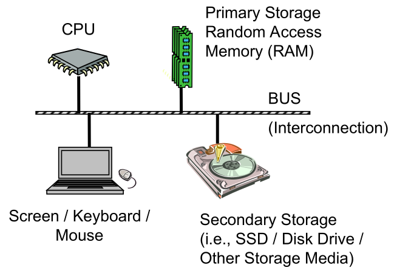
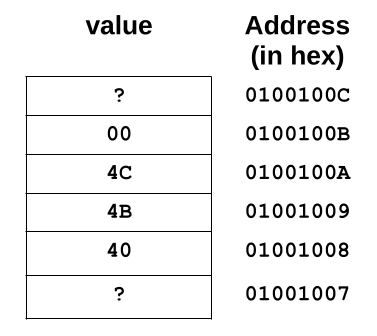
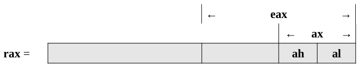

# Architecture Overview

**1/ Draw the picture of Von Neumann Architecture**

**2/ What architecture component connects the memory to the CPU?**

The bus component takes the role as communication channel between  memory and CPU

**3/ Where are programs stored when the computer is turned off?**

The program will be stored in the non-volatile memory which is secondary storage that could remains the data after the computer is turned off.

**4/ Where must programs be located when they are executing?**

When the program executing, it must be stored in the RAM, which is copied from the secondary storage, and then send to the CPU for execution.

**5/ How does cache memory help overall performance?**

Cache memory with the rapid speed for data retrieval could be used to stored the most frequent data that is requested from the program to avoid the repetition retrieval.

**6/ How many bytes does a C++ integer declared with the declaration int use?**

The *int* type will take 4 bytes when declaration in **C++**.

**7/ On the Intel X86-64 architecture, how many bytes can be stored at each address?**

For each address, 1 bytes of information could be stored in the Intel x86-64 architecture.

**8/ Given the 32-bit hex 004C4B4016 what is the LSB and MSB?**

The LSB is 40 and the MSB will be 00.

**9/ Given the 32-bit hex 004C4B4016, show the little edian memory layout showing each byte in memory?**

**10/ Draw a picture of the layout for the rax register**

**11/ How many bits does each of the following represent?**
- **al**: 1 byte
- **rcx**: 8 bytes
- **bx**: 2 bytes
- **edx**: 4 bytes
- **r1**: 8 bytes
- **r8b**: 1 byte
- **sil**: 1 byte
- **r14w**: 2 bytes

**12/ Which register points to the next instruction to be executed?**

Register **rip** is used to point to the next instruction.

**13/ Which register points to the current top of the stack?**

Register **rsp** is used to point to the current top of the stack.

**14/ If al is set to 0516 and ax is set to 000716, eax is set to 0000002016, and rax is set to 000000000000000016, and show the final complete contents of the complete rax register?**

After setting all the registers above, the complete content of rax will be 000000000000000016.

**15/ If the rax register is set to 123456789ABCDEF16,
what are the contents of the following registers in hex?**

- **al**: EF16
- **ax**: CDEF16
- **eax**: 89ABCDEF16
- **rax**: 123456789ABCDEF16

