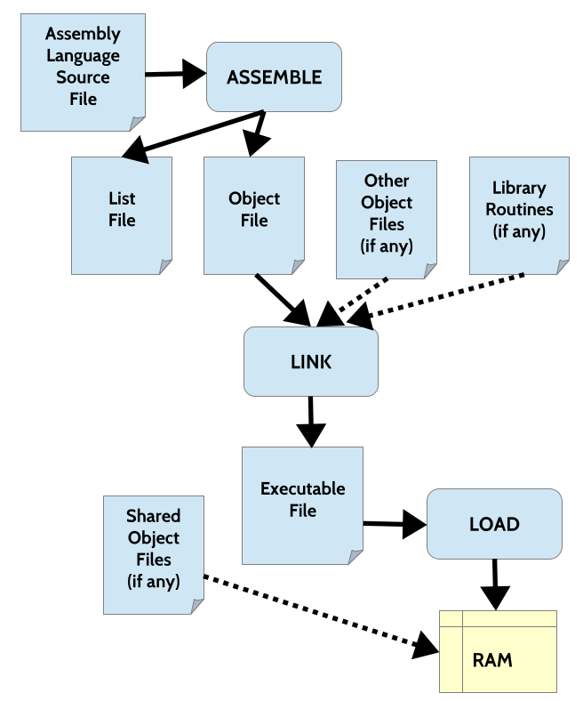

# Tool chain

**1/ What is the relationship between assembly language and machine language?**

The assembly language is the human-readable low-level language taht can be convert directly to machine language via assembler and converted back from it without missing any piece of code

**2/ What actions are performed on the first pass of the assembler?**

The first pass of the assembler often does three main task:
- Collect label to add to the symbol table
- Expanding the macro
- Evaluate the constant variables

**3/ What actions are performed on the second pass of the assembler**

On the second pass of the assembler, it will do three task as follow:
- Create the list file for debugging (optional)
- Generate and convert the assembly syntax into the CPU instruction code
- Lookup in the symbol table to convert the final version of the object file.

**4/ What actions are performed by the linker**

The linker perform the connection between multiple object file, that reallocate the address of function that defined by user file or library into a single executable file.

**5/ What actions are performed by the loader?**

The loader will copy the program store in the secondary memory into RAM for execution.

**6/ Provide an example of a constant expression**

A constant expression is PI * 2 where PI is the constant variable that already defined.

**7/ Draw a diagram of the entire assemble, link, and load process.**

**8/ When is a shared object file linked with a program?**

The shared object file is object file that oftenly used by the machine and not need to include it in the binary file everytime compile the program. Instead, it will be resolved and accessed as run time. It is also called as dynamic linking.

**9/ What is contained in the symbol table (two things)**

The symbol table contains the program symbol, variable name, label name and their corresponding address that will replace the appearance of the them when compiling the code.
